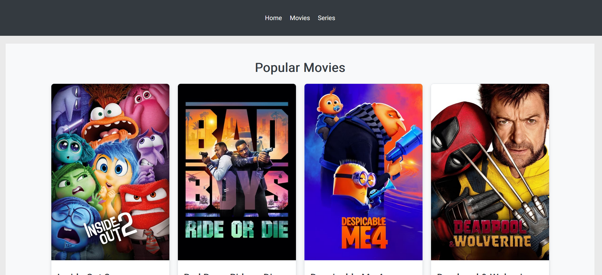
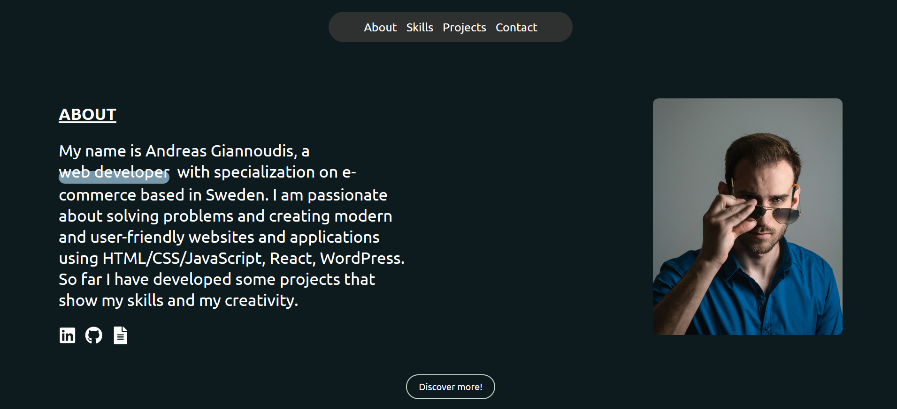
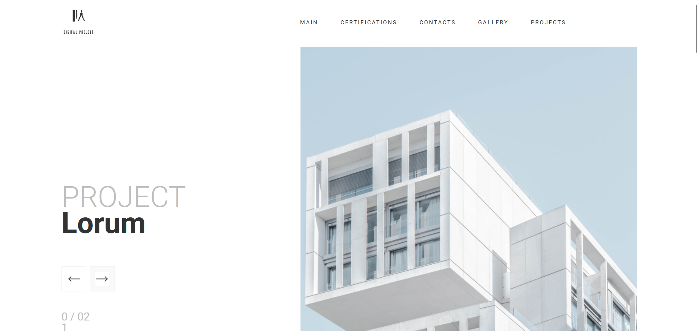
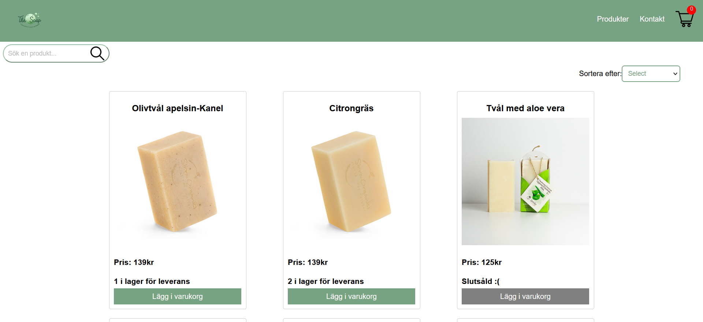
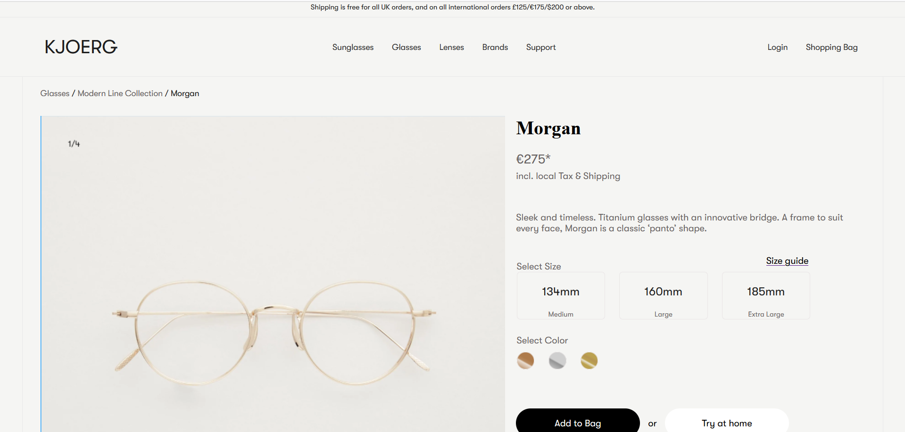

# Portfolio of Andreas Giannoudis

Welcome to my portfolio website. This repository showcases my work as a web developer and includes projects that demonstrate my skills and creativity.

## Table of Contents

- [Introduction](#introduction)
- [Features](#features)
- [Technologies Used](#technologies-used)
- [Installation](#installation)
- [Usage](#usage)
- [Projects](#projects)
- [Contact](#contact)
- [License](#license)

## Introduction

This is the personal portfolio of Andreas Giannoudis, a web developer based in Sweden. I am passionate about creating modern and user-friendly websites and applications using HTML, CSS, JavaScript, React, and WordPress. This portfolio highlights my skills, projects, and experiences in the field of web development.

## Features

- **Responsive Design**: Optimized for viewing on various devices.
- **Interactive Elements**: Includes smooth scrolling, animations, and more.
- **Showcase of Projects**: Detailed descriptions and links to my projects.
- **Contact Information**: Easy ways to get in touch with me.

## Technologies Used

- **React**: For building the user interface.
- **SASS**: For styling the application.
- **React Icons**: For including icons.
- **Intersection Observer**: For handling scroll animations.

## Installation

To run this project locally, follow these steps:

1. **Clone the repository**:
    ```bash
    git clone https://github.com/andreasgiannoudis/portfolio.git
    cd portfolio
    ```

2. **Install dependencies**:
    ```bash
    npm install
    ```

3. **Start the development server**:
    ```bash
    npm run dev
    ```

The application should now be running on `http://localhost:3000`.

## Usage

You can navigate through different sections of the portfolio to learn more about me and my work. The website includes sections for about, projects, skills, and contact information. You can also download my resume or connect with me on LinkedIn and GitHub.

## Projects

Here are some of the projects showcased in this portfolio:

1. **[Popular Movies and Series](https://popular-movies-series-6q6bgbiw2-andreasgiannoudis-projects.vercel.app/)**
   - **Description**: A movies/series webapp created with Next.js and SCSS. Designed and developed by me. This app allows users to search for movies and series, and discover popular ones by navigating through different pages.
   - 

2. **[Portfolio](#)**
   - **Description**: The portfolio you are seeing right now. Built with React and SASS for styling. Designed and built by me!
   - 

3. **WordPress Project**
   - **Description**: A custom WordPress project with a completely custom theme. Developed using PHP, WordPress editor, and SASS for styling. All content is dynamic. Unfortunately, this project is not live.
   - 

4. **[Web Shop](https://github.com/andreasgiannoudis/webb23-js2-slutprojekt-andreas-giannoudis)**
   - **Description**: A web shop built using React and Node.js. Users can add products to the cart and "purchase" them (note: no real payment processing).
   - 

5. **WordPress Product Page**
   - **Description**: A product page created with WordPress and WooCommerce, using PHP, SASS, and Vite.js. Everything except the products (which are created in WooCommerce) is customized. Unfortunately, this project is not live.
   - 


For a detailed view, visit the portfolio website.

## Contact

Feel free to reach out to me through the following channels:

- **LinkedIn**: [Andreas Giannoudis](https://www.linkedin.com/in/andreas-giannoudis/)
- **GitHub**: [andreasgiannoudis](https://github.com/andreasgiannoudis)
- **Email**: agiannoudis@hotmail.com

## License

This portfolio is built and maintained by Andreas Giannoudis. All rights reserved.

---

Built with ❤️ using React and SASS.